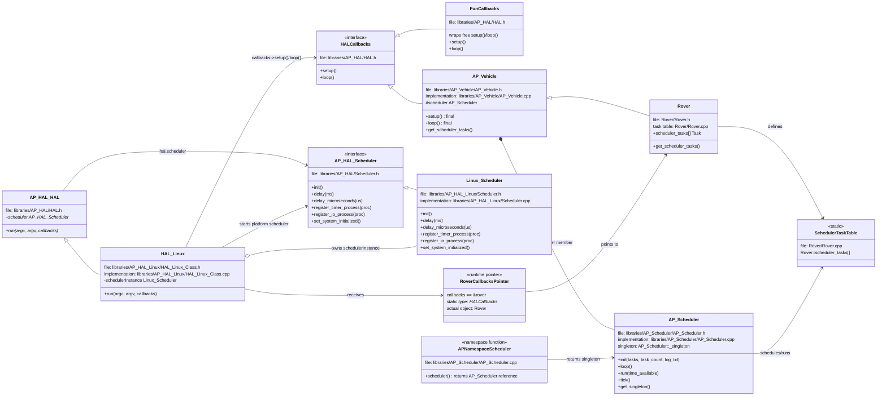

# Rover, Callbacks, AP_Scheduler, and Linux::Scheduler

Generated on 2026-05-02.

This document explains how Rover starts, how the callback object reaches the Linux HAL, why ArduPilot uses the `setup()` / `loop()` lifecycle, and how the vehicle scheduler (`AP_Scheduler`) differs from the Linux platform scheduler (`Linux::Scheduler`).

## Table of Contents

| Section | Contents |
| --- | --- |
| [1. Big Picture](#1-big-picture) | High-level Rover to HAL to scheduler flow. |
| [2. Runtime Call Chain](#2-runtime-call-chain) | End-to-end runtime call path. |
| [3. Execution Lifecycle: setup() / loop()](#3-execution-lifecycle-setup--loop) | Why ArduPilot keeps the common lifecycle pattern. |
| [4. Callback Dispatch and Implementations](#4-callback-dispatch-and-implementations) | Callback interface, HAL main macros, implementations, and Rover's callback object. |
| [5. Scheduler Ownership and Execution](#5-scheduler-ownership-and-execution) | Vehicle scheduler vs platform scheduler, Linux initialization, loop locations, and comparison. |
| [6. Rover Task Table](#6-rover-task-table) | `Rover::scheduler_tasks[]` and the numbered task list. |
| [7. Startup and Setup Functions](#7-startup-and-setup-functions) | Common `AP_Vehicle::setup()`, Rover `init_ardupilot()`, and scheduler hooks. |
| [8. Sensor Setup and Update Tasks](#8-sensor-setup-and-update-tasks) | Sensor initialization path and periodic sensor update tasks. |
| [9. Mermaid Class Diagram](#9-mermaid-class-diagram) | Class and ownership relations with file paths. |
| [10. Summary](#10-summary) | Condensed summary of the document. |
| [Appendix A. Source File Map](#appendix-a-source-file-map) | Relevant files and core terms. |
| [Appendix B. Abbreviations](#appendix-b-abbreviations) | Alphabetical abbreviation glossary. |

## 1. Big Picture

`Rover.cpp` does not directly include or call `AP_HAL_Linux/Scheduler.cpp`.

The code path is indirect:

```text
Rover application object
  defines global Rover rover
  passes &rover to AP_HAL_MAIN_CALLBACKS()

Generated entry point
  AP_HAL_MAIN_CALLBACKS(&rover)
  generates main()
  calls hal.run(argc, argv, &rover)

Linux HAL object ownership
  hal is AP_HAL::get_HAL()
  AP_HAL::get_HAL() returns global HAL_Linux hal_linux
  HAL_Linux owns Linux::Scheduler schedulerInstance
  HAL_Linux passes &schedulerInstance into AP_HAL::HAL
  AP_HAL::HAL stores it as hal.scheduler

Linux HAL runtime
  HAL_Linux::run()
  starts Linux::Scheduler through hal.scheduler
  calls callbacks->setup()
  repeatedly calls callbacks->loop()

Rover callback dispatch
  callbacks == &rover
  Rover inherits AP_Vehicle
  AP_Vehicle implements AP_HAL::HAL::Callbacks
  callbacks->loop() calls AP_Vehicle::loop()

Vehicle scheduler dispatch
  AP_Vehicle::loop()
  calls AP_Scheduler::loop()
  AP_Scheduler runs Rover::scheduler_tasks[]

Vehicle scheduler ownership
  AP_Vehicle has an AP_Scheduler scheduler member
  AP_Scheduler constructor sets the AP_Scheduler singleton
  AP::scheduler() returns that same scheduler object
```

The key distinction:

```text
Linux::Scheduler does not schedule Rover::scheduler_tasks[].
AP_Scheduler schedules Rover::scheduler_tasks[].
Linux::Scheduler provides HAL/platform timing, threads, delays, IO, UART, RC input, and timer callback services.
```

## 2. Runtime Call Chain

```text
Rover.cpp
  AP_HAL_MAIN_CALLBACKS(&rover)
    -> generated main()
      -> hal.run(argc, argv, &rover)
         where callbacks == &rover
        -> HAL_Linux::run(...)
          -> scheduler->init()
             -> Linux::Scheduler::init()
             -> starts Linux timer/uart/rcin/io platform threads
          -> scheduler->set_system_initialized()
             -> Linux::Scheduler::set_system_initialized()
          -> callbacks->setup()
             -> AP_Vehicle::setup() on the rover object
             -> AP::scheduler().init(...)
                initializes AP_Vehicle::scheduler
             -> Rover-specific init through virtual hooks
          -> loop forever:
               callbacks->loop()
                 -> AP_Vehicle::loop() on the rover object
                   -> AP_Scheduler::loop()
                     -> AP_Scheduler::run(time_available)
                       -> tasks from Rover::scheduler_tasks[]
```

## 3. Execution Lifecycle: setup() / loop()

ArduPilot keeps an Arduino-style lifecycle:

```text
setup()
  initialize once

loop()
  run repeatedly
```

The pattern is kept because ArduPilot runs on very different platforms:

- Linux needs process arguments, signal handling, pthreads, UART device paths, CPU affinity, and Linux scheduling.
- ChibiOS needs embedded board and hardware startup.
- SITL needs simulator timing and simulated devices.
- Examples and tests often only need small free `setup()` and `loop()` functions.

The lifecycle separation is:

```text
HAL::run()
  owns platform mechanics and the outer run loop

callbacks->setup()
callbacks->loop()
  own application or vehicle behavior
```

This is inversion of control: the HAL owns platform startup, then calls back into the vehicle or example. Rover does not need Linux-, ChibiOS-, or SITL-specific startup code in its main loop.

For full vehicles, `AP_Vehicle` keeps the lifecycle consistent:

```text
AP_Vehicle::setup()
  common vehicle initialization
  parameter loading
  scheduler initialization
  vehicle-specific initialization through hooks

AP_Vehicle::loop()
  common repeated vehicle loop
  calls AP_Scheduler::loop()
  runs the vehicle task table
```

`AP_Vehicle::loop()` is `final`, so Rover, Plane, Copter, Sub, Blimp, and Tracker do not each invent a different main loop. Vehicle-specific behavior is added through task tables and virtual hooks.

## 4. Callback Dispatch and Implementations

The callback path has three pieces:

| Piece | Role |
| --- | --- |
| `AP_HAL::HAL::Callbacks` | The interface with `setup()` and `loop()`. |
| HAL main macro | Generates the program entry point and passes a callback object to `hal.run(...)`. |
| Runtime callback object | The actual object received by `HAL_Linux::run(...)`; for Rover this is `&rover`. |

### Callback Interface

`AP_HAL::HAL::Callbacks` is defined in `libraries/AP_HAL/HAL.h`:

```cpp
struct Callbacks {
    virtual void setup() = 0;
    virtual void loop() = 0;
};
```

`HAL_Linux::run()` receives a pointer to this interface:

```cpp
void HAL_Linux::run(int argc, char* const argv[], Callbacks* callbacks) const
```

The HAL can therefore run any object that implements `setup()` and `loop()`, without knowing whether it is Rover, another vehicle, an example, or a tool.

### HAL Main Macros

Both macros are defined in `libraries/AP_HAL/AP_HAL_Main.h`.

Both generate the program entry point. The generated function name is `AP_MAIN`; if the build has not defined `AP_MAIN`, the header maps it to normal `main`:

```cpp
#ifndef AP_MAIN
#define AP_MAIN main
#endif
```

### AP_HAL_MAIN()

Use this when the program provides free functions:

```cpp
void setup() {}
void loop() {}

AP_HAL_MAIN();
```

The macro creates a callback wrapper:

```cpp
#define AP_HAL_MAIN() \
    AP_HAL::HAL::FunCallbacks callbacks(setup, loop); \
    extern "C" {                               \
    int AP_MAIN(int argc, char* const argv[]); \
    int AP_MAIN(int argc, char* const argv[]) { \
        hal.run(argc, argv, &callbacks); \
        return 0; \
    } \
    }
```

In short:

```text
AP_HAL_MAIN()
  creates AP_HAL::HAL::FunCallbacks callbacks(setup, loop)
  passes &callbacks to hal.run()
```

Examples using this style include:

```text
libraries/AP_HAL/examples/RCOutput/RCOutput.cpp
libraries/AP_HAL/examples/AnalogIn/AnalogIn.cpp
libraries/AP_AHRS/examples/AHRS_Test/AHRS_Test.cpp
```

### AP_HAL_MAIN_CALLBACKS(CALLBACKS)

Use this when an existing object implements `AP_HAL::HAL::Callbacks`.

```cpp
#define AP_HAL_MAIN_CALLBACKS(CALLBACKS) extern "C" { \
    int AP_MAIN(int argc, char* const argv[]); \
    int AP_MAIN(int argc, char* const argv[]) { \
        hal.run(argc, argv, CALLBACKS); \
        return 0; \
    } \
    }
```

Rover uses this style:

```cpp
Rover rover;
AP_Vehicle& vehicle = rover;

AP_HAL_MAIN_CALLBACKS(&rover);
```

That means:

```text
callbacks == &rover
```

Other full vehicles use the same pattern:

```cpp
Copter copter;
AP_Vehicle& vehicle = copter;

AP_HAL_MAIN_CALLBACKS(&copter);
```

Practical comparison:

```text
AP_HAL_MAIN()
  free setup()/loop()
  macro creates FunCallbacks
  common in examples and small tests

AP_HAL_MAIN_CALLBACKS(&object)
  object implements AP_HAL::HAL::Callbacks
  macro passes object directly to hal.run()
  common in full vehicle applications
```

### Callback Implementations

Relevant callback implementations in this tree include:

#### AP_Vehicle

Path: `libraries/AP_Vehicle/AP_Vehicle.h`

```cpp
class AP_Vehicle : public AP_HAL::HAL::Callbacks {
```

It implements:

```cpp
void setup(void) override final;
void loop() override final;
```

Full vehicles inherit that implementation:

```text
Rover   -> AP_Vehicle -> AP_HAL::HAL::Callbacks
Copter  -> AP_Vehicle -> AP_HAL::HAL::Callbacks
Plane   -> AP_Vehicle -> AP_HAL::HAL::Callbacks
Sub     -> AP_Vehicle -> AP_HAL::HAL::Callbacks
Blimp   -> AP_Vehicle -> AP_HAL::HAL::Callbacks
Tracker -> AP_Vehicle -> AP_HAL::HAL::Callbacks
```

#### FunCallbacks

Path: `libraries/AP_HAL/HAL.h`

```cpp
struct FunCallbacks : public Callbacks {
    FunCallbacks(void (*setup_fun)(void), void (*loop_fun)(void));

    void setup() override { _setup(); }
    void loop() override { _loop(); }
};
```

`AP_HAL_MAIN()` uses this wrapper for free `setup()` and `loop()` functions.

#### Replay

Path: `Tools/Replay/Replay.h`

```cpp
class Replay : public AP_HAL::HAL::Callbacks {
```

Replay is a tool, not normal live vehicle firmware. It implements its own callback lifecycle so it can replay logs through ArduPilot systems.

#### Direct Example/Test Classes

Some examples and tests implement callbacks directly when they need object state:

```text
libraries/RC_Channel/examples/RC_UART/RC_UART.cpp
  class RC_UART : public AP_HAL::HAL::Callbacks

libraries/AP_FlashStorage/examples/FlashTest/FlashTest.cpp
  class FlashTest : public AP_HAL::HAL::Callbacks

libraries/AP_Logger/examples/AP_Logger_AllTypes/AP_Logger_AllTypes.cpp
  class AP_LoggerTest_AllTypes : public AP_HAL::HAL::Callbacks
```

### Rover's Callback Object

For Rover, the real object is the global `rover` object:

```cpp
Rover rover;
AP_Vehicle& vehicle = rover;

AP_HAL_MAIN_CALLBACKS(&rover);
```

Because the macro calls:

```cpp
hal.run(argc, argv, &rover);
```

the runtime facts are:

```text
callbacks == &rover
static parameter type: AP_HAL::HAL::Callbacks*
actual object:         Rover rover
base class path:       Rover -> AP_Vehicle -> AP_HAL::HAL::Callbacks
```

There is no `Rover::loop()` implementation in `Rover.cpp`.

`Rover` inherits from `AP_Vehicle`:

```cpp
class Rover : public AP_Vehicle {
```

`AP_Vehicle` implements the callback methods:

```cpp
void setup(void) override final;
void loop() override final;
```

Therefore:

```text
callbacks->setup()
  calls AP_Vehicle::setup() on the rover object

callbacks->loop()
  calls AP_Vehicle::loop() on the rover object
```

Rover-specific behavior is reached from inside those inherited `AP_Vehicle` methods through virtual hooks and Rover's task table.

## 5. Scheduler Ownership and Execution

ArduPilot uses two different scheduler layers in this path:

| Layer | Scheduler | Owner | Main job |
| --- | --- | --- | --- |
| Vehicle/application | `AP_Scheduler` | `AP_Vehicle` | Runs `Rover::scheduler_tasks[]`. |
| HAL/platform | `Linux::Scheduler` | `HAL_Linux` | Provides Linux timing, delays, worker threads, IO, UART, RC input, and timer/failsafe callback services. |

### Linux HAL Scheduler Ownership

For a Linux build, `AP_HAL::get_HAL()` returns `hal_linux`.

Path: `libraries/AP_HAL_Linux/HAL_Linux_Class.cpp`

```cpp
HAL_Linux hal_linux;

const AP_HAL::HAL &AP_HAL::get_HAL()
{
    return hal_linux;
}

AP_HAL::HAL &AP_HAL::get_HAL_mutable()
{
    return hal_linux;
}
```

`HAL_Linux` owns the platform scheduler instance:

```cpp
static Scheduler schedulerInstance;
```

and passes it into the generic HAL:

```cpp
HAL_Linux::HAL_Linux() :
    AP_HAL::HAL(
        ...
        &rcinDriver,
        &rcoutDriver,
        &schedulerInstance,
        &utilInstance,
        ...
    )
{}
```

The base HAL stores that pointer.

Path: `libraries/AP_HAL/HAL.h`

```cpp
AP_HAL::Scheduler*  _scheduler,
...
scheduler(_scheduler),
...
AP_HAL::Scheduler* scheduler;
```

Therefore:

```text
hal.scheduler -> Linux::Scheduler schedulerInstance
```

### How Linux::Scheduler Is Initialized

`HAL_Linux::run()` initializes the platform scheduler before it calls the vehicle callback setup.

Path: `libraries/AP_HAL_Linux/HAL_Linux_Class.cpp`

```cpp
scheduler->init();
gpio->init();
rcout->init();
rcin->init();
serial(0)->begin(115200);
analogin->init();
utilInstance.init(argc+gopt.optind-1, &argv[gopt.optind-1]);

scheduler->set_system_initialized();

callbacks->setup();
```

The initialization sequence is:

```text
static Scheduler schedulerInstance
  -> constructed as part of Linux HAL static objects

HAL_Linux::HAL_Linux()
  -> passes &schedulerInstance into AP_HAL::HAL(...)

AP_HAL::HAL constructor
  -> stores that pointer as hal.scheduler

HAL_Linux::run(...)
  -> scheduler->init()
     -> Linux::Scheduler::init()
     -> configures realtime scheduling when applicable
     -> applies CPU affinity when configured
     -> creates synchronization barrier
     -> starts timer, uart, rcin, and io worker threads
  -> initializes other HAL drivers
  -> scheduler->set_system_initialized()
  -> callbacks->setup()
  -> repeatedly calls callbacks->loop()
```

Path: `libraries/AP_HAL_Linux/Scheduler.cpp`

```cpp
void Scheduler::init()
{
    const struct sched_table sched_table[] = {
        SCHED_THREAD(timer, TIMER),
        SCHED_THREAD(uart, UART),
        SCHED_THREAD(rcin, RCIN),
        SCHED_THREAD(io, IO),
    };

    _main_ctx = pthread_self();

    init_realtime();
    init_cpu_affinity();

    unsigned n_threads = ARRAY_SIZE(sched_table) + 1;
    pthread_barrier_init(&_initialized_barrier, nullptr, n_threads);

    for (size_t i = 0; i < ARRAY_SIZE(sched_table); i++) {
        const struct sched_table *t = &sched_table[i];

        t->thread->set_rate(t->rate);
        t->thread->set_stack_size(1024 * 1024);
        t->thread->start(t->name, t->policy, t->prio);
    }
}
```

So Linux platform scheduling is initialized by `HAL_Linux::run()` calling `scheduler->init()`. It is not initialized by Rover and it does not consume `Rover::scheduler_tasks[]`.

### AP_Vehicle and AP_Scheduler Ownership

`AP_Vehicle` gets `AP_Scheduler` by owning it directly as a member.

Path: `libraries/AP_Vehicle/AP_Vehicle.h`

```cpp
#if AP_SCHEDULER_ENABLED
    // main loop scheduler
    AP_Scheduler scheduler;
#endif
```

Because Rover inherits from `AP_Vehicle`, the global `Rover rover` object contains the `AP_Vehicle` base object and therefore contains this `scheduler` member.

The global accessor `AP::scheduler()` does not create another scheduler. It returns the singleton pointer set by the `AP_Scheduler` constructor.

Path: `libraries/AP_Scheduler/AP_Scheduler.cpp`

```cpp
AP_Scheduler::AP_Scheduler()
{
    if (_singleton) {
        ...
        return;
    }
    _singleton = this;

    AP_Param::setup_object_defaults(this, var_info);
}
```

The accessor is:

```cpp
namespace AP {

AP_Scheduler &scheduler()
{
    return *AP_Scheduler::get_singleton();
}

};
```

This setup call:

```cpp
AP::scheduler().init(tasks, task_count, log_bit);
```

initializes the scheduler member inside the vehicle object. In simplified form:

```text
global Rover rover is constructed
  -> AP_Vehicle base is constructed
  -> AP_Vehicle::scheduler member is constructed
  -> AP_Scheduler::AP_Scheduler()
     -> AP_Scheduler::_singleton = this

AP_Vehicle::setup()
  -> Rover::get_scheduler_tasks(...)
  -> AP::scheduler().init(...)
     -> returns the AP_Vehicle::scheduler member
     -> stores Rover::scheduler_tasks[] in AP_Scheduler
```

Inside `AP_Scheduler::init()`, the vehicle task table is stored:

```cpp
_vehicle_tasks = tasks;
_num_vehicle_tasks = num_tasks;
```

That is the handoff from Rover's static task table to the live vehicle scheduler owned by `AP_Vehicle`.

### Loop Locations

#### HAL_Linux::run Is the Outer Platform Loop

Path: `libraries/AP_HAL_Linux/HAL_Linux_Class.cpp`

```cpp
scheduler->init();
gpio->init();
rcout->init();
rcin->init();
serial(0)->begin(115200);
analogin->init();
utilInstance.init(argc+gopt.optind-1, &argv[gopt.optind-1]);

scheduler->set_system_initialized();

callbacks->setup();

while (!_should_exit) {
    callbacks->loop();
}
```

This starts platform services and then repeatedly calls the callback loop.

#### AP_Vehicle::loop Drives the Vehicle Scheduler

Path: `libraries/AP_Vehicle/AP_Vehicle.cpp`

```cpp
void AP_Vehicle::loop()
{
#if AP_SCHEDULER_ENABLED
    scheduler.loop();
    G_Dt = scheduler.get_loop_period_s();
#else
    hal.scheduler->delay(1);
    G_Dt = 0.001;
#endif
}
```

This `scheduler` is the vehicle scheduler (`AP_Scheduler`), not the platform scheduler (`Linux::Scheduler`).

#### AP_Scheduler::loop Runs Due Tasks

Path: `libraries/AP_Scheduler/AP_Scheduler.cpp`

```cpp
void AP_Scheduler::loop()
{
    ...
    tick();
    ...
    run(time_available);
}
```

`run(time_available)` runs due tasks from the configured vehicle task table.

### Linux::Scheduler Responsibilities

Path: `libraries/AP_HAL_Linux/Scheduler.cpp`

`Linux::Scheduler::init()` creates HAL/platform worker threads:

```cpp
void Scheduler::init()
{
    ...
    const struct sched_table sched_table[] = {
        SCHED_THREAD(timer, TIMER),
        SCHED_THREAD(uart, UART),
        SCHED_THREAD(rcin, RCIN),
        SCHED_THREAD(io, IO),
    };
    ...
    t->thread->start(t->name, t->policy, t->prio);
}
```

It also implements platform scheduler services:

```cpp
void Scheduler::delay(uint16_t ms);
void Scheduler::delay_microseconds(uint16_t us);
void Scheduler::register_timer_process(AP_HAL::MemberProc proc);
void Scheduler::register_io_process(AP_HAL::MemberProc proc);
void Scheduler::register_timer_failsafe(AP_HAL::Proc failsafe, uint32_t period_us);
void Scheduler::set_system_initialized();
```

Therefore:

```text
Linux::Scheduler schedules and services HAL platform work.
It does not choose read_radio(), ahrs_update(), or set_servos().
```

### Scheduler Comparison

| Question | AP_Scheduler | Linux::Scheduler |
| --- | --- | --- |
| Layer | Vehicle/application | HAL/platform |
| Main files | `libraries/AP_Scheduler/*` | `libraries/AP_HAL_Linux/Scheduler.*` |
| Main loop | `AP_Scheduler::loop()` | Linux worker threads plus HAL scheduler methods |
| Uses `Rover::scheduler_tasks[]`? | Yes | No |
| Who owns it? | `AP_Vehicle` owns an `AP_Scheduler scheduler` member | `HAL_Linux` owns `Linux::Scheduler schedulerInstance` |
| Runs `read_radio()`, `ahrs_update()`, `set_servos()`? | Yes | No |
| Handles `hal.scheduler->delay()`? | No | Yes |
| Handles timer, UART, RC input, IO platform threads? | No | Yes |
| Started by | `AP_Vehicle::setup()` initializes it; `AP_Vehicle::loop()` runs it | `HAL_Linux::run()` calls `scheduler->init()` |

## 6. Rover Task Table

Path: `Rover/Rover.cpp`

```cpp
const AP_Scheduler::Task Rover::scheduler_tasks[] = {
    SCHED_TASK(read_radio,             50,    200,   3),
    SCHED_TASK(ahrs_update,           400,    400,   6),
    SCHED_TASK(update_current_mode,   400,    200,  12),
    SCHED_TASK(set_servos,            400,    200,  15),
    ...
};
```

This table defines scheduled vehicle work:

- function to run
- requested rate
- expected maximum runtime
- priority relative to other vehicle tasks

The vehicle scheduler (`AP_Scheduler`) uses this table. The platform scheduler (`Linux::Scheduler`) does not.

### Rover Task List

The task table in `Rover.cpp` contains these entries. Some entries are only compiled when their feature flag is enabled.

| No. | Task | Rate Hz | Max us | Priority | Condition |
| ---: | --- | ---: | ---: | ---: | --- |
| 1 | `read_radio` | 50 | 200 | 3 | always |
| 2 | `ahrs_update` | 400 | 400 | 6 | always |
| 3 | `read_rangefinders` | 50 | 200 | 9 | `AP_RANGEFINDER_ENABLED` |
| 4 | `AP_OpticalFlow::update` | 200 | 160 | 11 | `AP_OPTICALFLOW_ENABLED` |
| 5 | `update_current_mode` | 400 | 200 | 12 | always |
| 6 | `set_servos` | 400 | 200 | 15 | always |
| 7 | `AP_GPS::update` | 50 | 300 | 18 | always |
| 8 | `AP_Baro::update` | 10 | 200 | 21 | always |
| 9 | `AP_Beacon::update` | 50 | 200 | 24 | `AP_BEACON_ENABLED` |
| 10 | `AP_Proximity::update` | 50 | 200 | 27 | `HAL_PROXIMITY_ENABLED` |
| 11 | `AP_WindVane::update` | 20 | 100 | 30 | always |
| 12 | `update_wheel_encoder` | 50 | 200 | 36 | always |
| 13 | `update_compass` | 10 | 200 | 39 | always |
| 14 | `update_logging1` | 10 | 200 | 45 | `HAL_LOGGING_ENABLED` |
| 15 | `update_logging2` | 10 | 200 | 48 | `HAL_LOGGING_ENABLED` |
| 16 | `GCS::update_receive` | 400 | 500 | 51 | always |
| 17 | `GCS::update_send` | 400 | 1000 | 54 | always |
| 18 | `RC_Channels::read_mode_switch` | 7 | 200 | 57 | always |
| 19 | `RC_Channels::read_aux_all` | 10 | 200 | 60 | always |
| 20 | `AP_BattMonitor::read` | 10 | 300 | 63 | always |
| 21 | `AP_ServoRelayEvents::update_events` | 50 | 200 | 66 | `AP_SERVORELAYEVENTS_ENABLED` |
| 22 | `update_precland` | 400 | 50 | 70 | `AC_PRECLAND_ENABLED` |
| 23 | `AP_Mount::update` | 50 | 200 | 75 | `HAL_MOUNT_ENABLED` |
| 24 | `AP_Camera::update` | 50 | 200 | 78 | `AP_CAMERA_ENABLED` |
| 25 | `gcs_failsafe_check` | 10 | 200 | 81 | always |
| 26 | `fence_check` | 10 | 200 | 84 | `AP_FENCE_ENABLED` |
| 27 | `ekf_check` | 10 | 100 | 87 | always |
| 28 | `ModeSmartRTL::save_position` | 3 | 200 | 90 | always |
| 29 | `one_second_loop` | 1 | 1500 | 96 | always |
| 30 | `AC_Sprayer::update` | 3 | 90 | 99 | `HAL_SPRAYER_ENABLED` |
| 31 | `AP_Logger::periodic_tasks` | 50 | 300 | 108 | `HAL_LOGGING_ENABLED` |
| 32 | `AP_InertialSensor::periodic` | 400 | 200 | 111 | always |
| 33 | `AP_Scheduler::update_logging` | 0.1 | 200 | 114 | `HAL_LOGGING_ENABLED` |
| 34 | `AP_Button::update` | 5 | 200 | 117 | `HAL_BUTTON_ENABLED` |
| 35 | `crash_check` | 10 | 200 | 123 | always |
| 36 | `cruise_learn_update` | 50 | 200 | 126 | always |
| 37 | `afs_fs_check` | 10 | 200 | 129 | `AP_ROVER_ADVANCED_FAILSAFE_ENABLED` |

## 7. Startup and Setup Functions

Startup is split between common vehicle setup and Rover-specific initialization.

### Common AP_Vehicle Setup

Path: `libraries/AP_Vehicle/AP_Vehicle.cpp`

The common setup callback is:

```cpp
void AP_Vehicle::setup()
```

Major setup steps include:

| No. | Function or action | Purpose |
| ---: | --- | --- |
| 1 | `AP_Param::setup_sketch_defaults()` | Load default parameter values from `var_info[]`. |
| 2 | `serial_manager.init_console()` | Initialize the console early when serial manager is enabled. |
| 3 | `AP_Param::check_var_info()` | Validate the parameter metadata table. |
| 4 | `load_parameters()` | Calls the vehicle override; for Rover this is `Rover::load_parameters()`. |
| 5 | `get_scheduler_tasks(...)` | Calls the vehicle override; for Rover this returns `Rover::scheduler_tasks[]`. |
| 6 | `AP::scheduler().init(tasks, task_count, log_bit)` | Initializes the vehicle-level `AP_Scheduler` with Rover's task table. |
| 7 | `set_control_channels()` | Sets control channels early. |
| 8 | `gcs().init()` | Initializes GCS support when enabled. |
| 9 | `serial_manager.init()` | Initializes serial ports. |
| 10 | `gcs().setup_console()` | Sets up console routing through GCS support. |
| 11 | `networking.init()` | Initializes networking when enabled. |
| 12 | `hal.scheduler->register_delay_callback(...)` | Registers a delay callback with the HAL scheduler. |
| 13 | `externalAHRS.init()` | Initializes external AHRS before vehicle-specific init when enabled. |
| 14 | `generator.init()` | Initializes generator support when enabled. |
| 15 | `stats.init()` | Initializes stats support when enabled. |
| 16 | `BoardConfig.init()` | Initializes board configuration. |
| 17 | `can_mgr.init()` | Initializes CAN manager when enabled. |
| 18 | `msp.init()` | Initializes MSP before vehicle-specific init when enabled. |
| 19 | `logger.init(...)` | Initializes logging when enabled. |
| 20 | `AP::gripper().init()` | Initializes gripper support when enabled. |
| 21 | `init_ardupilot()` | Calls the vehicle-specific init hook; for Rover this is `Rover::init_ardupilot()`. |
| 22 | `scripting.init()` | Initializes scripting after vehicle-specific init when enabled. |
| 23 | `airspeed.init()` | Initializes airspeed support when enabled. |
| 24 | `AP::srv().init()` | Initializes SRV channel support when enabled. |
| 25 | `gyro_fft.init(...)` | Initializes gyro FFT support late when enabled. |
| 26 | `hott_telem.init()` | Initializes HoTT telemetry when enabled. |
| 27 | `visual_odom.init()` | Initializes visual odometry when enabled. |
| 28 | `vtx.init()`, `smartaudio.init()`, `tramp.init()` | Initialize video transmitter related backends when enabled. |
| 29 | `opendroneid.init()` | Initializes OpenDroneID when enabled. |
| 30 | `efi.init()` | Initializes EFI monitoring when enabled. |
| 31 | `temperature_sensor.init()` | Initializes temperature sensor support when enabled. |
| 32 | `kdecan.init()` | Initializes KDE CAN support when enabled. |
| 33 | `ais.init()` | Initializes AIS when enabled. |
| 34 | `nmea.init()` | Initializes NMEA output when enabled. |
| 35 | `fence.init()` and `fence_init()` | Initializes fence support when enabled. |
| 36 | `custom_rotations.init()` | Initializes custom rotations when enabled. |
| 37 | `filters.init()` | Initializes filter support when enabled. |
| 38 | `rpm_sensor.init()` | Initializes RPM sensor support when enabled. |
| 39 | `AP::arming().init()` | Initializes arming checks when enabled. |
| 40 | `AP_Param::invalidate_count()` | Invalidates parameter count after setup may have changed enabled modules. |
| 41 | `GCS_SEND_TEXT(..., "ArduPilot Ready")` | Announces startup completion. |
| 42 | `ibus_telem.init()` | Initializes IBUS telemetry when enabled. |

### Rover-Specific init_ardupilot()

Path: `Rover/system.cpp`

The Rover-specific hook is:

```cpp
void Rover::init_ardupilot()
```

Major Rover initialization steps include:

| No. | Function or action | Purpose |
| ---: | --- | --- |
| 1 | `notify.init()` | Initializes notify system. |
| 2 | `notify_mode(control_mode)` | Updates notify state for current mode. |
| 3 | `battery.init()` | Initializes battery monitoring. |
| 4 | `rssi.init()` | Initializes RSSI when enabled. |
| 5 | `g2.windvane.init(serial_manager)` | Initializes wind vane support. |
| 6 | `barometer.init()` | Initializes barometer early. |
| 7 | `gcs().setup_uarts()` | Sets up GCS UARTs. |
| 8 | `osd.init()` | Initializes OSD when enabled. |
| 9 | `AP::compass().init()` | Initializes compass after setting log bit. |
| 10 | `rangefinder.init(ROTATION_NONE)` | Initializes rangefinder when enabled. |
| 11 | `g2.proximity.init()` | Initializes proximity when enabled. |
| 12 | `g2.beacon.init()` | Initializes beacon support when enabled. |
| 13 | `barometer.calibrate()` | Calibrates barometer for EKF use. |
| 14 | `gps.init()` | Initializes GPS after setting log bit. |
| 15 | `init_rc_in()` | Sets up RC channel deadzone/input handling. |
| 16 | `g2.motors.init(get_frame_type())` | Initializes motors and servo output ranges. |
| 17 | `AP::srv().enable_aux_servos()` | Enables auxiliary servo outputs. |
| 18 | `g2.wheel_encoder.init()` | Initializes wheel encoders. |
| 19 | `g2.torqeedo.init()` | Initializes Torqeedo motor driver when enabled. |
| 20 | `optflow.init(MASK_LOG_OPTFLOW)` | Initializes optical flow when enabled. |
| 21 | `relay.init()` | Initializes relay support when enabled. |
| 22 | `camera_mount.init()` | Initializes camera mount when enabled. |
| 23 | `camera.init()` | Initializes camera support when enabled. |
| 24 | `init_precland()` | Initializes precision landing when enabled. |
| 25 | `hal.scheduler->register_timer_failsafe(failsafe_check_static, 1000)` | Registers the main-loop-dead failsafe with the HAL scheduler. |
| 26 | `g2.smart_rtl.init()` | Initializes SmartRTL. |
| 27 | `g2.oa.init()` | Initializes object avoidance when enabled. |
| 28 | `set_mode(mode_initializing, ModeReason::INITIALISED)` | Enters initializing mode. |
| 29 | `startup_INS()` | Starts and initializes INS/AHRS path. |
| 30 | `mode_auto.mission.init()` | Initializes mission library when enabled. |
| 31 | `logger.setVehicle_Startup_Writer(...)` | Registers Rover startup log writer when logging is enabled. |
| 32 | `mode_from_mode_num(...)` and `set_mode(...)` | Selects and enters initial mode. |
| 33 | `rc().convert_options(...)` | Converts old RC aux options to current meanings. |
| 34 | `rc().init()` | Initializes RC channels. |
| 35 | `rover.g2.sailboat.init()` | Initializes sailboat support. |
| 36 | `rover.g2.mis_done_behave.set_default(...)` | Sets boat mission-complete behavior default. |
| 37 | `initialised = true` | Marks Rover initialization complete. |

### Rover Parameter and Scheduler Hooks

Path: `Rover/Parameters.cpp`

```cpp
void Rover::load_parameters(void)
```

This is called from `AP_Vehicle::setup()` through the virtual `load_parameters()` hook. It calls:

```cpp
AP_Vehicle::load_parameters(g.format_version, Parameters::k_format_version);
```

then performs Rover-specific parameter conversion and defaults.

Path: `Rover/Rover.cpp`

```cpp
void Rover::get_scheduler_tasks(const AP_Scheduler::Task *&tasks,
                                uint8_t &task_count,
                                uint32_t &log_bit)
```

This is called from `AP_Vehicle::setup()`. It returns:

```cpp
tasks = &scheduler_tasks[0];
task_count = ARRAY_SIZE(scheduler_tasks);
log_bit = MASK_LOG_PM;
```

This is how `AP_Vehicle::setup()` gives Rover's task table to the vehicle scheduler.

## 8. Sensor Setup and Update Tasks

Sensor setup happens during startup. Sensor updates happen later through scheduled tasks.

The high-level path is:

```text
HAL_Linux::run()
  -> callbacks->setup()
    -> AP_Vehicle::setup()
      -> common setup
      -> init_ardupilot()
        -> Rover::init_ardupilot()
          -> Rover sensor setup
```

After setup completes, periodic sensor work is handled by the vehicle scheduler through `Rover::scheduler_tasks[]`.

### Common Sensor-Related Setup

Path: `libraries/AP_Vehicle/AP_Vehicle.cpp`

Some sensor setup is common across vehicles and happens in `AP_Vehicle::setup()`:

| No. | Function | Purpose |
| ---: | --- | --- |
| 1 | `externalAHRS.init()` | Initializes external AHRS before vehicle-specific init when enabled. |
| 2 | `airspeed.init()` | Initializes airspeed sensor support after `init_ardupilot()` when enabled. |
| 3 | `airspeed.calibrate(true)` | Calibrates airspeed when enabled and present. |
| 4 | `gyro_fft.init(...)` | Initializes gyro FFT late, after scheduler loop rate is known. |
| 5 | `visual_odom.init()` | Initializes visual odometry when enabled. |
| 6 | `temperature_sensor.init()` | Initializes temperature sensor support when enabled. |
| 7 | `rpm_sensor.init()` | Initializes RPM sensor support when enabled. |

### Rover-Specific Sensor Setup

Path: `Rover/system.cpp`

Most Rover sensor setup happens in:

```cpp
void Rover::init_ardupilot()
```

Major Rover sensor setup steps include:

| No. | Function | Sensor/System |
| ---: | --- | --- |
| 1 | `battery.init()` | Battery monitor |
| 2 | `rssi.init()` | RSSI, if enabled |
| 3 | `g2.windvane.init(serial_manager)` | Wind vane |
| 4 | `barometer.init()` | Barometer |
| 5 | `AP::compass().init()` | Compass |
| 6 | `rangefinder.init(ROTATION_NONE)` | Rangefinder, if enabled |
| 7 | `g2.proximity.init()` | Proximity sensor, if enabled |
| 8 | `g2.beacon.init()` | Beacon/non-GPS positioning, if enabled |
| 9 | `barometer.calibrate()` | Barometer calibration for EKF |
| 10 | `gps.init()` | GPS |
| 11 | `ins.set_log_raw_bit(...)` | Raw IMU logging setup |
| 12 | `g2.wheel_encoder.init()` | Wheel encoders |
| 13 | `optflow.init(...)` | Optical flow, if enabled |
| 14 | `startup_INS()` | AHRS and inertial sensor initialization |

### INS and AHRS Setup

Path: `Rover/system.cpp`

```cpp
void Rover::startup_INS(void)
{
    GCS_SEND_TEXT(MAV_SEVERITY_INFO, "Beginning INS calibration. Do not move vehicle");
    hal.scheduler->delay(100);

    ahrs.init();
    ahrs.set_fly_forward(true);
    ahrs.set_vehicle_class(AP_AHRS::VehicleClass::GROUND);

    ins.init(scheduler.get_loop_rate_hz());
    ahrs.reset();
}
```

The INS/AHRS setup sequence is:

```text
startup_INS()
  -> warn user not to move vehicle
  -> hal.scheduler->delay(100)
  -> ahrs.init()
  -> configure AHRS for ground vehicle behavior
  -> ins.init(scheduler.get_loop_rate_hz())
  -> ahrs.reset()
```

This sequence uses both scheduler layers:

```text
hal.scheduler->delay(100)
  uses the platform scheduler, Linux::Scheduler on Linux.

scheduler.get_loop_rate_hz()
  uses the vehicle scheduler, AP_Scheduler.
```

### Periodic Sensor Update Tasks

After setup, periodic sensor-related work is run from `Rover::scheduler_tasks[]` by the vehicle scheduler.

Examples:

| Task | Rate Hz | Sensor/System |
| --- | ---: | --- |
| `ahrs_update` | 400 | AHRS/EKF update path |
| `AP_InertialSensor::periodic` | 400 | IMU periodic work |
| `AP_GPS::update` | 50 | GPS |
| `AP_Baro::update` | 10 | Barometer |
| `update_compass` | 10 | Compass |
| `read_rangefinders` | 50 | Rangefinders, if enabled |
| `AP_OpticalFlow::update` | 200 | Optical flow, if enabled |
| `AP_Proximity::update` | 50 | Proximity, if enabled |
| `AP_Beacon::update` | 50 | Beacon, if enabled |
| `AP_WindVane::update` | 20 | Wind vane |
| `update_wheel_encoder` | 50 | Wheel encoders |
| `AP_BattMonitor::read` | 10 | Battery monitor |

Summary:

```text
Sensor initialization
  happens once in AP_Vehicle::setup() and Rover::init_ardupilot().

Sensor updates
  happen repeatedly through AP_Scheduler and Rover::scheduler_tasks[].
```

## 9. Mermaid Class Diagram

File paths are relative to `ardupilot/`.



## 10. Summary

```text
setup()/loop()
  common lifecycle pattern

AP_HAL_MAIN()
  wraps free setup()/loop() in FunCallbacks

AP_HAL_MAIN_CALLBACKS(&rover)
  passes the existing Rover object as callbacks

callbacks in HAL_Linux::run()
  static type: AP_HAL::HAL::Callbacks*
  actual object: &rover
  calls AP_Vehicle::setup() and AP_Vehicle::loop() on Rover

AP_Vehicle::loop()
  calls AP_Scheduler::loop()

AP_Scheduler
  is owned by AP_Vehicle as the scheduler member
  is also available through AP::scheduler()
  schedules and runs Rover::scheduler_tasks[]

Linux::Scheduler
  is owned by HAL_Linux as schedulerInstance
  provides Linux threads, delays, IO, UART, RC input, and timer/failsafe callbacks
```

## Appendix A. Source File Map

Paths are relative to `ardupilot/`.

### Files

| Concept | File |
| --- | --- |
| Rover class | `Rover/Rover.h` |
| Rover object, task table, HAL main macro | `Rover/Rover.cpp` |
| Common vehicle callback implementation | `libraries/AP_Vehicle/AP_Vehicle.h`, `libraries/AP_Vehicle/AP_Vehicle.cpp` |
| Vehicle scheduler and singleton accessor | `libraries/AP_Scheduler/AP_Scheduler.h`, `libraries/AP_Scheduler/AP_Scheduler.cpp` |
| Generic HAL and callback interface | `libraries/AP_HAL/HAL.h` |
| HAL main macros | `libraries/AP_HAL/AP_HAL_Main.h` |
| Linux HAL object and `run()` | `libraries/AP_HAL_Linux/HAL_Linux_Class.h`, `libraries/AP_HAL_Linux/HAL_Linux_Class.cpp` |
| Generic HAL scheduler interface | `libraries/AP_HAL/Scheduler.h` |
| Linux platform scheduler | `libraries/AP_HAL_Linux/Scheduler.h`, `libraries/AP_HAL_Linux/Scheduler.cpp` |
| Replay callback implementation | `Tools/Replay/Replay.h`, `Tools/Replay/Replay.cpp` |

### Terms

| Term | Meaning |
| --- | --- |
| Callback object | The object passed to `hal.run(...)`; for Rover this is `&rover`. |
| Vehicle scheduler | `AP_Scheduler`, owned by `AP_Vehicle`, runs vehicle task tables. |
| Platform scheduler | `Linux::Scheduler`, owned by `HAL_Linux`, provides HAL timing, delays, threads, and platform callbacks. |
| Task table | The static `Rover::scheduler_tasks[]` array in `Rover/Rover.cpp`. |

## Appendix B. Abbreviations

| Abbreviation | Meaning |
| --- | --- |
| AHRS | Attitude and Heading Reference System. Estimates vehicle attitude and heading. |
| AIS | Automatic Identification System. Marine vessel tracking support. |
| AP | ArduPilot. Used as a common prefix for ArduPilot libraries and namespaces. |
| AP_HAL | ArduPilot Hardware Abstraction Layer. |
| CAN | Controller Area Network. Vehicle/peripheral bus used by some devices. |
| CPU | Central Processing Unit. Mentioned for Linux CPU affinity. |
| DDS | Data Distribution Service. Middleware used by some ArduPilot integrations. |
| EFI | Electronic Fuel Injection. Engine monitoring support. |
| EKF | Extended Kalman Filter. State estimator used by the AHRS/navigation stack. |
| ESC | Electronic Speed Controller. Motor controller device. |
| FFT | Fast Fourier Transform. Used here for gyro vibration/noise analysis. |
| GCS | Ground Control Station. MAVLink-facing communication with tools such as Mission Planner or MAVProxy. |
| GNSS | Global Navigation Satellite System. General term for satellite navigation receivers; GPS is one GNSS. |
| GPS | Global Positioning System. In ArduPilot naming this often covers GNSS receiver handling more generally. |
| HAL | Hardware Abstraction Layer. The layer between vehicle code and platform-specific drivers. |
| IBUS | FlySky i-BUS telemetry/control protocol support. |
| IMU | Inertial Measurement Unit. Accelerometer/gyroscope sensor hardware. |
| INS | Inertial Navigation System. ArduPilot's inertial sensor integration path. |
| IO | Input/Output. In this document, usually platform-level IO handled by HAL services. |
| KDE | KDE Direct CAN ESC support in ArduPilot. |
| MAVLink | Micro Air Vehicle Link. Message protocol used between ArduPilot and ground/control systems. |
| MSP | MultiWii Serial Protocol. Serial protocol used by some sensors and peripherals. |
| NMEA | National Marine Electronics Association protocol family, commonly used for navigation output. |
| OSD | On-Screen Display. Video overlay support. |
| RC | Radio Control. Pilot input channels and related switch/auxiliary inputs. |
| RCIN | RC input. Used as a Linux scheduler worker-thread name. |
| RCOUT | RC output. Used for servo/motor output handling in HAL startup. |
| RPM | Revolutions Per Minute. Rotational speed sensor support. |
| RSSI | Received Signal Strength Indicator. Radio link signal strength measurement. |
| SITL | Software In The Loop. ArduPilot running against simulated hardware and physics. |
| SRV | Servo output abstraction used by ArduPilot's SRV channel library. |
| UART | Universal Asynchronous Receiver/Transmitter. Serial ports used for telemetry, GPS, and other peripherals. |
