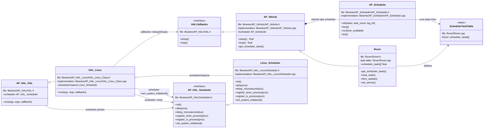

# How Rover.cpp Links To AP_HAL_Linux/Scheduler.cpp

Generated on 2026-05-02.

`Rover.cpp` does not directly include or call `ardupilot/libraries/AP_HAL_Linux/Scheduler.cpp`. The connection is made through the AP_HAL abstraction: `Rover.cpp` uses the global `hal` object, and for a Linux build that object is a `HAL_Linux` instance whose `scheduler` pointer is a `Linux::Scheduler` object.

## Short Version

1. `Rover.cpp` gets the active HAL with `AP_HAL::get_HAL()`.
2. In a Linux build, `AP_HAL::get_HAL()` returns the global `HAL_Linux hal_linux` object.
3. `HAL_Linux` constructs the generic `AP_HAL::HAL` base class and passes `&schedulerInstance` into it.
4. The base `AP_HAL::HAL` stores that pointer as `hal.scheduler`.
5. `AP_HAL_MAIN_CALLBACKS(&rover)` creates `main()` and calls `hal.run(argc, argv, &rover)`.
6. Because `hal` is really `HAL_Linux`, that calls `HAL_Linux::run()`.
7. `HAL_Linux::run()` calls `scheduler->init()` and `scheduler->set_system_initialized()`.
8. Those virtual calls dispatch to methods implemented in `AP_HAL_Linux/Scheduler.cpp`.

## Key Code Path

### 1. Rover.cpp Gets The HAL

Path: `ardupilot/Rover/Rover.cpp`

```cpp
const AP_HAL::HAL& hal = AP_HAL::get_HAL();
```

This line gives Rover access to the board-specific HAL. It is written against the generic `AP_HAL::HAL` interface, so Rover does not need to know whether the target is Linux, ChibiOS, SITL, or another HAL.

### 2. Rover.cpp Defines The Program Entry Point

Path: `ardupilot/Rover/Rover.cpp`

```cpp
Rover rover;
AP_Vehicle& vehicle = rover;

AP_HAL_MAIN_CALLBACKS(&rover);
```

`Rover rover` creates the vehicle object. `AP_HAL_MAIN_CALLBACKS(&rover)` expands to a `main()` function that passes the Rover object into the HAL as callbacks.

The macro comes from `ardupilot/libraries/AP_HAL/AP_HAL_Main.h`:

```cpp
#define AP_HAL_MAIN_CALLBACKS(CALLBACKS) extern "C" { \
    int AP_MAIN(int argc, char* const argv[]); \
    int AP_MAIN(int argc, char* const argv[]) { \
        hal.run(argc, argv, CALLBACKS); \
        return 0; \
    } \
    }
```

So Rover startup becomes approximately:

```cpp
int main(int argc, char* const argv[]) {
    hal.run(argc, argv, &rover);
    return 0;
}
```

Important detail: there is no `Rover::loop()` implementation in `Rover.cpp`. `Rover` inherits from `AP_Vehicle`:

```cpp
class Rover : public AP_Vehicle {
```

`AP_Vehicle` inherits from `AP_HAL::HAL::Callbacks`:

```cpp
class AP_Vehicle : public AP_HAL::HAL::Callbacks {
```

and implements the HAL callbacks as final methods:

```cpp
void setup(void) override final;
void loop() override final;
```

So when `HAL_Linux::run()` calls `callbacks->setup()` and `callbacks->loop()`, the functions actually called are `AP_Vehicle::setup()` and `AP_Vehicle::loop()`. Rover-specific behavior is reached through virtual hooks and through Rover's scheduler task table.

### 3. Linux Build Provides The HAL Object

Path: `ardupilot/libraries/AP_HAL_Linux/HAL_Linux_Class.cpp`

```cpp
HAL_Linux hal_linux;

const AP_HAL::HAL &AP_HAL::get_HAL()
{
    return hal_linux;
}

AP_HAL::HAL &AP_HAL::get_HAL_mutable()
{
    return hal_linux;
}
```

For a Linux target, `AP_HAL::get_HAL()` returns `hal_linux`. This is why the `hal` reference in `Rover.cpp` is actually referring to a Linux HAL object at runtime.

### 4. HAL_Linux Wires In The Linux Scheduler

Path: `ardupilot/libraries/AP_HAL_Linux/HAL_Linux_Class.cpp`

```cpp
static Scheduler schedulerInstance;

HAL_Linux::HAL_Linux() :
    AP_HAL::HAL(
        ...
        &rcinDriver,
        &rcoutDriver,
        &schedulerInstance,
        &utilInstance,
        ...
    )
{}
```

`schedulerInstance` is a `Linux::Scheduler`. The Linux HAL passes its address into the generic `AP_HAL::HAL` constructor.

### 5. AP_HAL::HAL Stores The Scheduler Pointer

Path: `ardupilot/libraries/AP_HAL/HAL.h`

The constructor accepts a scheduler pointer:

```cpp
AP_HAL::Scheduler*  _scheduler,
```

Then stores it:

```cpp
scheduler(_scheduler),
```

The public member is:

```cpp
AP_HAL::Scheduler* scheduler;
```

After construction, `hal.scheduler` points to the Linux scheduler instance.

### 6. HAL_Linux::run Starts The Scheduler

Path: `ardupilot/libraries/AP_HAL_Linux/HAL_Linux_Class.cpp`

```cpp
scheduler->init();
gpio->init();
rcout->init();
rcin->init();
serial(0)->begin(115200);
analogin->init();
utilInstance.init(argc+gopt.optind-1, &argv[gopt.optind-1]);

scheduler->set_system_initialized();

callbacks->setup();

while (!_should_exit) {
    callbacks->loop();
}
```

Here `scheduler` is the `AP_HAL::HAL::scheduler` pointer. Since it points to `Linux::Scheduler`, these calls execute code from `AP_HAL_Linux/Scheduler.cpp`.

The `callbacks->loop()` call does not call a `Rover::loop()` method in `Rover.cpp`. It calls `AP_Vehicle::loop()`, because `Rover` inherits that final callback implementation from `AP_Vehicle`.

### 7. AP_HAL_Linux/Scheduler.cpp Implements The Platform Scheduler

Path: `ardupilot/libraries/AP_HAL_Linux/Scheduler.cpp`

```cpp
void Scheduler::init()
{
    ...
    init_realtime();
    init_cpu_affinity();
    ...
    t->thread->start(t->name, t->policy, t->prio);
}
```

This creates Linux scheduler worker threads for timer, UART, RC input, and IO work.

```cpp
void Scheduler::set_system_initialized()
{
    if (_initialized) {
        AP_HAL::panic("PANIC: scheduler::set_system_initialized called more than once");
    }

    _initialized = true;
    _wait_all_threads();
}
```

This marks the platform scheduler initialized and waits for worker threads to synchronize.

## Runtime Call Chain

```text
Rover.cpp
  AP_HAL_MAIN_CALLBACKS(&rover)
    -> generated main()
      -> hal.run(argc, argv, &rover)
        -> HAL_Linux::run(...)
          -> scheduler->init()
             -> Linux::Scheduler::init() in AP_HAL_Linux/Scheduler.cpp
          -> scheduler->set_system_initialized()
             -> Linux::Scheduler::set_system_initialized() in AP_HAL_Linux/Scheduler.cpp
          -> rover.setup()
          -> loop forever:
               callbacks->loop()
                 -> AP_Vehicle::loop()
                   -> AP_Scheduler::loop()
                     -> Rover::scheduler_tasks[]
```

## Mermaid Class Diagram

This diagram shows the important ownership, inheritance, and callback relationships. It separates the platform scheduler (`Linux::Scheduler`) from the vehicle task scheduler (`AP_Scheduler`).



Read it as:

- `Rover` inherits from `AP_Vehicle`.
- `AP_Vehicle` implements the `AP_HAL::HAL::Callbacks` interface, including the final `loop()` method.
- `HAL_Linux` inherits from the generic `AP_HAL::HAL`.
- `HAL_Linux` owns a `Linux::Scheduler` instance and passes it into the base HAL as `hal.scheduler`.
- `Linux::Scheduler` implements the platform scheduler interface, `AP_HAL::Scheduler`.
- `AP_Vehicle` owns or accesses the vehicle-level `AP_Scheduler`.
- `Rover.cpp` defines `Rover::scheduler_tasks[]`; `AP_Scheduler::loop()` runs those tasks.

File locations in the diagram are relative to `ardupilot/`.

## Vehicle Scheduler vs HAL Scheduler

There are two scheduler concepts involved:

### AP_Scheduler

Defined in `ardupilot/libraries/AP_Scheduler`. This is the vehicle task scheduler. Rover's task table lives in `Rover.cpp`:

```cpp
const AP_Scheduler::Task Rover::scheduler_tasks[] = {
    SCHED_TASK(read_radio, 50, 200, 3),
    SCHED_TASK(ahrs_update, 400, 400, 6),
    ...
};
```

This decides which Rover tasks run at rates like 400 Hz, 50 Hz, 10 Hz, and 1 Hz.

The loop that drives this task table is in `AP_Vehicle::loop()`, not in `Rover.cpp`:

```cpp
void AP_Vehicle::loop()
{
#if AP_SCHEDULER_ENABLED
    scheduler.loop();
    G_Dt = scheduler.get_loop_period_s();
#else
    hal.scheduler->delay(1);
    G_Dt = 0.001;
#endif
}
```

That `scheduler.loop()` is the `AP_Scheduler` vehicle-task scheduler. It eventually runs tasks selected from `Rover::scheduler_tasks[]`.

### AP_HAL_Linux::Scheduler

Defined in `ardupilot/libraries/AP_HAL_Linux/Scheduler.cpp`. This is the Linux platform scheduler. It handles Linux threads, delays, timer callbacks, IO callbacks, failsafe callbacks, and realtime scheduling setup.

The two are related but not the same object. Rover's `AP_Scheduler` runs vehicle tasks. The Linux HAL scheduler provides the platform timing and threading services underneath it.

## Direct Uses From Rover Code

Rover and common vehicle code can call the HAL scheduler directly through `hal.scheduler`, for example:

```cpp
hal.scheduler->register_timer_failsafe(failsafe_check_static, 1000);
hal.scheduler->delay(100);
hal.scheduler->is_system_initialized();
```

On Linux, these calls dispatch to `Linux::Scheduler` methods in `AP_HAL_Linux/Scheduler.cpp`.

## Summary

`Rover.cpp` links to `AP_HAL_Linux/Scheduler.cpp` through object construction and virtual calls, not through a direct include. The build selects the Linux HAL, `AP_HAL::get_HAL()` returns `hal_linux`, `HAL_Linux` installs `Linux::Scheduler` as `hal.scheduler`, and the generic Rover code reaches Linux scheduler behavior through `hal.run()` and `hal.scheduler->...` calls.

There is no separate `Rover::loop()` in `Rover.cpp`. The generated `main()` passes `&rover` as an `AP_HAL::HAL::Callbacks` object, `HAL_Linux::run()` calls `callbacks->loop()`, and that dispatches to `AP_Vehicle::loop()`. From there, `AP_Scheduler::loop()` runs Rover's task table.
