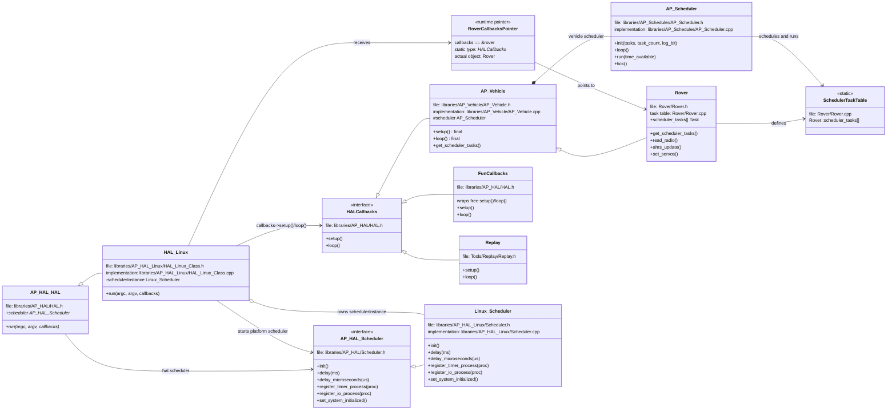

# Rover, AP_Scheduler, And Linux::Scheduler

Generated on 2026-05-02.

This note explains how `Rover.cpp` reaches `ardupilot/libraries/AP_HAL_Linux/Scheduler.cpp`, why there is no `Rover::loop()` in `Rover.cpp`, and how the vehicle task scheduler differs from the Linux platform scheduler.

## Core Idea

`Rover.cpp` does not directly include or call `AP_HAL_Linux/Scheduler.cpp`.

The connection is indirect:

1. `Rover.cpp` gets the active HAL with `AP_HAL::get_HAL()`.
2. In a Linux build, `AP_HAL::get_HAL()` returns the global `HAL_Linux hal_linux`.
3. `HAL_Linux` passes a `Linux::Scheduler` object into the generic `AP_HAL::HAL` base class.
4. The base HAL stores that object as `hal.scheduler`.
5. `AP_HAL_MAIN_CALLBACKS(&rover)` creates `main()` and calls `hal.run(argc, argv, &rover)`.
6. Because `hal` is actually `HAL_Linux`, this calls `HAL_Linux::run()`.
7. `HAL_Linux::run()` starts the Linux platform scheduler and repeatedly calls the vehicle callback loop.
8. The vehicle callback loop is `AP_Vehicle::loop()`, not `Rover::loop()`.
9. `AP_Vehicle::loop()` calls `AP_Scheduler::loop()`.
10. `AP_Scheduler::loop()` runs tasks from `Rover::scheduler_tasks[]`.

## The Correct Mental Model

There are two scheduler layers:

```text
Linux::Scheduler
  Platform/HAL scheduler.
  Provides Linux threads, delays, timer callbacks, IO callbacks, UART polling,
  RC input polling, failsafe callback support, realtime setup, and CPU affinity.

AP_Scheduler
  Vehicle task scheduler.
  Runs the Rover task table: read_radio(), ahrs_update(),
  update_current_mode(), set_servos(), logging tasks, and so on.
```

Important correction:

```text
Linux::Scheduler does not schedule Rover::scheduler_tasks[].

AP_Scheduler schedules Rover::scheduler_tasks[].

Linux::Scheduler supports lower-level timing/threading services underneath.
```

## Source File Map

Paths are relative to `ardupilot/`.

| Concept | File |
| --- | --- |
| Rover class | `Rover/Rover.h` |
| Rover task table and HAL main macro use | `Rover/Rover.cpp` |
| Generic vehicle callback implementation | `libraries/AP_Vehicle/AP_Vehicle.h`, `libraries/AP_Vehicle/AP_Vehicle.cpp` |
| Vehicle task scheduler | `libraries/AP_Scheduler/AP_Scheduler.h`, `libraries/AP_Scheduler/AP_Scheduler.cpp` |
| Generic HAL and callback interface | `libraries/AP_HAL/HAL.h` |
| HAL main macro | `libraries/AP_HAL/AP_HAL_Main.h` |
| Linux HAL object and run loop | `libraries/AP_HAL_Linux/HAL_Linux_Class.h`, `libraries/AP_HAL_Linux/HAL_Linux_Class.cpp` |
| Generic HAL scheduler interface | `libraries/AP_HAL/Scheduler.h` |
| Linux platform scheduler | `libraries/AP_HAL_Linux/Scheduler.h`, `libraries/AP_HAL_Linux/Scheduler.cpp` |

## Startup Path

### 1. Rover Gets The Active HAL

Path: `Rover/Rover.cpp`

```cpp
const AP_HAL::HAL& hal = AP_HAL::get_HAL();
```

This gives Rover a reference to the board-specific HAL through the generic `AP_HAL::HAL` interface.

### 2. Rover Passes Itself As HAL Callbacks

Path: `Rover/Rover.cpp`

```cpp
Rover rover;
AP_Vehicle& vehicle = rover;

AP_HAL_MAIN_CALLBACKS(&rover);
```

The macro expands to a generated `main()` function. Conceptually, it becomes:

```cpp
int main(int argc, char* const argv[])
{
    hal.run(argc, argv, &rover);
    return 0;
}
```

The actual macro is in `libraries/AP_HAL/AP_HAL_Main.h`:

```cpp
#define AP_HAL_MAIN_CALLBACKS(CALLBACKS) extern "C" { \
    int AP_MAIN(int argc, char* const argv[]); \
    int AP_MAIN(int argc, char* const argv[]) { \
        hal.run(argc, argv, CALLBACKS); \
        return 0; \
    } \
    }
```

## What The Real callbacks Object Is

In `HAL_Linux::run()`, the signature is:

```cpp
void HAL_Linux::run(int argc, char* const argv[], Callbacks* callbacks) const
```

The real object behind `callbacks` is the global `rover` object from `Rover.cpp`.

Path: `Rover/Rover.cpp`

```cpp
Rover rover;
AP_Vehicle& vehicle = rover;

AP_HAL_MAIN_CALLBACKS(&rover);
```

Because `AP_HAL_MAIN_CALLBACKS(&rover)` expands to a generated `main()` that calls:

```cpp
hal.run(argc, argv, &rover);
```

the `callbacks` parameter receives this pointer:

```text
callbacks == &rover
```

The types are:

```text
static parameter type: AP_HAL::HAL::Callbacks*
actual object:         Rover rover
base class path:       Rover -> AP_Vehicle -> AP_HAL::HAL::Callbacks
```

The callback methods are implemented by `AP_Vehicle`, not by a separate `Rover::loop()` in `Rover.cpp`:

```cpp
class AP_Vehicle : public AP_HAL::HAL::Callbacks {
    void setup(void) override final;
    void loop() override final;
};
```

So these calls in `HAL_Linux::run()`:

```cpp
callbacks->setup();
callbacks->loop();
```

mean:

```text
call AP_Vehicle::setup() on the rover object
call AP_Vehicle::loop() on the rover object
```

Rover-specific work is reached from inside those inherited `AP_Vehicle` callback methods, especially through Rover's scheduler task table and virtual hooks.

## Why ArduPilot Uses setup()/loop()

The `setup()` / `loop()` shape is a common ArduPilot pattern inherited from the Arduino-style sketch model:

```text
setup()
  initialize once

loop()
  run repeatedly
```

ArduPilot keeps this pattern because it gives every firmware target the same application lifecycle while still letting each HAL control platform-specific startup.

The separation is:

```text
HAL::run()
  owns platform startup and the outer process/thread loop

callbacks->setup()
callbacks->loop()
  own vehicle or application behavior
```

This is useful because ArduPilot runs on very different targets:

- Linux needs process arguments, signal handling, pthreads, UART paths, and Linux scheduling.
- ChibiOS needs embedded board and hardware startup.
- SITL needs simulator timing and simulated hardware.
- Examples and tests may only need small free `setup()` and `loop()` functions.

Without callbacks, each vehicle would need to know how every platform starts and runs. With callbacks, each HAL knows how to run the platform, and the vehicle only provides the lifecycle behavior.

For simple examples, the pattern can be free functions:

```cpp
void setup() {}
void loop() {}

AP_HAL_MAIN();
```

For full vehicles such as Rover, the pattern is object-based:

```cpp
Rover rover;
AP_HAL_MAIN_CALLBACKS(&rover);
```

The actual callback methods come from `AP_Vehicle`:

```cpp
class AP_Vehicle : public AP_HAL::HAL::Callbacks {
    void setup(void) override final;
    void loop() override final;
};
```

That means all vehicles share the same high-level lifecycle:

```text
AP_Vehicle::setup()
  common vehicle initialization
  parameter loading
  scheduler initialization
  vehicle-specific initialization through hooks

AP_Vehicle::loop()
  common repeated vehicle loop
  calls AP_Scheduler::loop()
  runs the vehicle task table
```

`loop()` is `final` in `AP_Vehicle` so Rover, Plane, Copter, and other vehicles do not each invent a different main loop. Vehicle-specific behavior is added through scheduler task tables and virtual hooks instead.

In short:

```text
setup()/loop() gives ArduPilot one common lifecycle.
HAL::run() owns platform mechanics.
AP_Vehicle owns the common vehicle lifecycle.
Rover supplies Rover-specific tasks and hooks.
```

## AP_HAL_MAIN vs AP_HAL_MAIN_CALLBACKS

Both macros are defined in:

```text
libraries/AP_HAL/AP_HAL_Main.h
```

They both generate the program entry point. The generated function name is `AP_MAIN`; if `AP_MAIN` has not already been defined, `AP_HAL_Main.h` defines it as normal C/C++ `main`:

```cpp
#ifndef AP_MAIN
#define AP_MAIN main
#endif
```

So both forms ultimately create:

```cpp
int main(int argc, char* const argv[])
```

or an equivalent `AP_MAIN(...)` entry point if the build has renamed it.

### AP_HAL_MAIN()

`AP_HAL_MAIN()` is for examples and sketch-style programs that provide plain global functions:

```cpp
void setup() {}
void loop() {}

AP_HAL_MAIN();
```

Its macro definition creates a `FunCallbacks` object from those free functions:

```cpp
#define AP_HAL_MAIN() \
    AP_HAL::HAL::FunCallbacks callbacks(setup, loop); \
    extern "C" {                               \
    int AP_MAIN(int argc, char* const argv[]); \
    int AP_MAIN(int argc, char* const argv[]) { \
        hal.run(argc, argv, &callbacks); \
        return 0; \
    } \
    }
```

So the callback object is:

```text
AP_HAL::HAL::FunCallbacks callbacks(setup, loop)
```

and `FunCallbacks::setup()` calls the global `setup()` function, while `FunCallbacks::loop()` calls the global `loop()` function.

Examples using this style include:

```text
libraries/AP_HAL/examples/RCOutput/RCOutput.cpp
libraries/AP_HAL/examples/AnalogIn/AnalogIn.cpp
libraries/AP_AHRS/examples/AHRS_Test/AHRS_Test.cpp
```

### AP_HAL_MAIN_CALLBACKS(CALLBACKS)

`AP_HAL_MAIN_CALLBACKS(...)` is for code that already has an object implementing `AP_HAL::HAL::Callbacks`.

Its macro definition directly passes that object to `hal.run()`:

```cpp
#define AP_HAL_MAIN_CALLBACKS(CALLBACKS) extern "C" { \
    int AP_MAIN(int argc, char* const argv[]); \
    int AP_MAIN(int argc, char* const argv[]) { \
        hal.run(argc, argv, CALLBACKS); \
        return 0; \
    } \
    }
```

Rover uses this style:

```cpp
Rover rover;
AP_Vehicle& vehicle = rover;

AP_HAL_MAIN_CALLBACKS(&rover);
```

The callback object is:

```text
&rover
```

Because `Rover` inherits from `AP_Vehicle`, and `AP_Vehicle` implements `AP_HAL::HAL::Callbacks`, this is valid.

Other full vehicle call sites use the same object-callback pattern, for example:

```cpp
Copter copter;
AP_Vehicle& vehicle = copter;

AP_HAL_MAIN_CALLBACKS(&copter);
```

### Practical Difference

```text
AP_HAL_MAIN()
  Use when setup() and loop() are free functions.
  The macro creates a FunCallbacks wrapper object.
  Common in examples, sketches, and small tests.

AP_HAL_MAIN_CALLBACKS(&object)
  Use when an existing object implements AP_HAL::HAL::Callbacks.
  The macro passes that object directly to hal.run().
  Common in full vehicles such as Rover, Copter, Plane, Sub, Blimp, and Tracker.
```

## Who Implements AP_HAL::HAL::Callbacks

`AP_HAL::HAL::Callbacks` is the small interface that a HAL can call through:

```cpp
struct Callbacks {
    virtual void setup() = 0;
    virtual void loop() = 0;
};
```

In this source tree, the direct implementations fall into a few categories.

### Real Vehicles

Path: `libraries/AP_Vehicle/AP_Vehicle.h`

```cpp
class AP_Vehicle : public AP_HAL::HAL::Callbacks {
```

`AP_Vehicle` is the important implementation for normal vehicle firmware. It implements:

```cpp
void setup(void) override final;
void loop() override final;
```

Vehicle classes inherit that implementation:

```text
Rover   -> AP_Vehicle -> AP_HAL::HAL::Callbacks
Copter  -> AP_Vehicle -> AP_HAL::HAL::Callbacks
Plane   -> AP_Vehicle -> AP_HAL::HAL::Callbacks
Sub     -> AP_Vehicle -> AP_HAL::HAL::Callbacks
Blimp   -> AP_Vehicle -> AP_HAL::HAL::Callbacks
Tracker -> AP_Vehicle -> AP_HAL::HAL::Callbacks
```

For Rover, `callbacks == &rover`, but the callback methods are inherited from `AP_Vehicle`.

### Replay Tool

Path: `Tools/Replay/Replay.h`

```cpp
class Replay : public AP_HAL::HAL::Callbacks {
```

`Replay` is a tool, not a normal live vehicle firmware. It implements its own `setup()` and `loop()` so it can replay logs through ArduPilot systems.

### Direct Example/Test Classes

Some examples and tests implement `AP_HAL::HAL::Callbacks` directly when they want object-style state plus `setup()` and `loop()` methods.

Examples in this tree include:

```text
libraries/RC_Channel/examples/RC_UART/RC_UART.cpp
  class RC_UART : public AP_HAL::HAL::Callbacks

libraries/AP_FlashStorage/examples/FlashTest/FlashTest.cpp
  class FlashTest : public AP_HAL::HAL::Callbacks

libraries/AP_Logger/examples/AP_Logger_AllTypes/AP_Logger_AllTypes.cpp
  class AP_LoggerTest_AllTypes : public AP_HAL::HAL::Callbacks
```

### FunCallbacks Wrapper

Path: `libraries/AP_HAL/HAL.h`

```cpp
struct FunCallbacks : public Callbacks {
    FunCallbacks(void (*setup_fun)(void), void (*loop_fun)(void));

    void setup() override { _setup(); }
    void loop() override { _loop(); }
};
```

This is used by the simpler macro:

```cpp
AP_HAL_MAIN();
```

`AP_HAL_MAIN()` is for programs that define free functions:

```cpp
void setup() {}
void loop() {}

AP_HAL_MAIN();
```

The macro wraps those free functions in a `FunCallbacks` object and passes that object to `hal.run()`.

So the practical categories are:

```text
Full vehicles:
  AP_Vehicle implements Callbacks.
  Rover, Copter, Plane, Sub, Blimp, and Tracker inherit that implementation.

Special tool:
  Replay implements Callbacks directly.

Examples/tests:
  Some implement their own callback class directly.
  Many use FunCallbacks through AP_HAL_MAIN().
```

### 3. Linux Provides The HAL Object

Path: `libraries/AP_HAL_Linux/HAL_Linux_Class.cpp`

```cpp
HAL_Linux hal_linux;

const AP_HAL::HAL &AP_HAL::get_HAL()
{
    return hal_linux;
}

AP_HAL::HAL &AP_HAL::get_HAL_mutable()
{
    return hal_linux;
}
```

For a Linux build, the global `hal` reference in `Rover.cpp` refers to `hal_linux`.

### 4. HAL_Linux Installs Linux::Scheduler Into The HAL

Path: `libraries/AP_HAL_Linux/HAL_Linux_Class.cpp`

```cpp
static Scheduler schedulerInstance;

HAL_Linux::HAL_Linux() :
    AP_HAL::HAL(
        ...
        &rcinDriver,
        &rcoutDriver,
        &schedulerInstance,
        &utilInstance,
        ...
    )
{}
```

`schedulerInstance` is a `Linux::Scheduler`. It is passed into the base `AP_HAL::HAL` constructor.

### 5. AP_HAL::HAL Stores The Scheduler Pointer

Path: `libraries/AP_HAL/HAL.h`

The constructor accepts a scheduler pointer:

```cpp
AP_HAL::Scheduler*  _scheduler,
```

and stores it as:

```cpp
scheduler(_scheduler),
```

The public member is:

```cpp
AP_HAL::Scheduler* scheduler;
```

So, after construction:

```text
hal.scheduler -> Linux::Scheduler schedulerInstance
```

## Where The Loops Are

### HAL_Linux::run Is The Outer Process Loop

Path: `libraries/AP_HAL_Linux/HAL_Linux_Class.cpp`

```cpp
scheduler->init();
gpio->init();
rcout->init();
rcin->init();
serial(0)->begin(115200);
analogin->init();
utilInstance.init(argc+gopt.optind-1, &argv[gopt.optind-1]);

scheduler->set_system_initialized();

callbacks->setup();

while (!_should_exit) {
    callbacks->loop();
}
```

This does two separate things:

- It starts platform services through `scheduler->init()` and `scheduler->set_system_initialized()`. On Linux, those calls dispatch to `Linux::Scheduler` in `AP_HAL_Linux/Scheduler.cpp`.
- It repeatedly calls `callbacks->loop()`. Since `&rover` was passed as the callbacks object, this reaches the vehicle callback implementation inherited from `AP_Vehicle`.

### There Is No Rover::loop In Rover.cpp

Path: `Rover/Rover.h`

```cpp
class Rover : public AP_Vehicle {
```

Path: `libraries/AP_Vehicle/AP_Vehicle.h`

```cpp
class AP_Vehicle : public AP_HAL::HAL::Callbacks {
```

`AP_Vehicle` implements the HAL callbacks as final methods:

```cpp
void setup(void) override final;
void loop() override final;
```

So this call in `HAL_Linux::run()`:

```cpp
callbacks->loop();
```

does not call `Rover::loop()` from `Rover.cpp`. It calls:

```text
AP_Vehicle::loop()
```

### AP_Vehicle::loop Drives AP_Scheduler

Path: `libraries/AP_Vehicle/AP_Vehicle.cpp`

```cpp
void AP_Vehicle::loop()
{
#if AP_SCHEDULER_ENABLED
    scheduler.loop();
    G_Dt = scheduler.get_loop_period_s();
#else
    hal.scheduler->delay(1);
    G_Dt = 0.001;
#endif
}
```

This `scheduler` is the vehicle-level `AP_Scheduler`, not `Linux::Scheduler`.

### AP_Scheduler::loop Runs The Task Table

Path: `libraries/AP_Scheduler/AP_Scheduler.cpp`

```cpp
void AP_Scheduler::loop()
{
    ...
    tick();
    ...
    run(time_available);
}
```

`run(time_available)` runs due tasks from the configured vehicle task table.

## Rover's Task Table

Path: `Rover/Rover.cpp`

```cpp
const AP_Scheduler::Task Rover::scheduler_tasks[] = {
    SCHED_TASK(read_radio,             50,    200,   3),
    SCHED_TASK(ahrs_update,           400,    400,   6),
    SCHED_TASK(update_current_mode,   400,    200,  12),
    SCHED_TASK(set_servos,            400,    200,  15),
    ...
};
```

This table defines Rover vehicle work:

- which function to run
- how often to run it
- how long it is expected to take
- its priority relative to other vehicle tasks

`AP_Scheduler`, not `Linux::Scheduler`, uses this table.

## Linux::Scheduler's Job

Path: `libraries/AP_HAL_Linux/Scheduler.cpp`

`Linux::Scheduler::init()` creates platform worker threads:

```cpp
void Scheduler::init()
{
    ...
    const struct sched_table sched_table[] = {
        SCHED_THREAD(timer, TIMER),
        SCHED_THREAD(uart, UART),
        SCHED_THREAD(rcin, RCIN),
        SCHED_THREAD(io, IO),
    };
    ...
    t->thread->start(t->name, t->policy, t->prio);
}
```

It also provides HAL services such as:

```cpp
void Scheduler::delay(uint16_t ms);
void Scheduler::delay_microseconds(uint16_t us);
void Scheduler::register_timer_process(AP_HAL::MemberProc proc);
void Scheduler::register_io_process(AP_HAL::MemberProc proc);
void Scheduler::register_timer_failsafe(AP_HAL::Proc failsafe, uint32_t period_us);
void Scheduler::set_system_initialized();
```

So `Linux::Scheduler` schedules and services HAL/platform work, not Rover's `AP_Scheduler::Task` table.

## Runtime Call Chain

```text
Rover.cpp
  AP_HAL_MAIN_CALLBACKS(&rover)
    -> generated main()
      -> hal.run(argc, argv, &rover)
         where callbacks == &rover
        -> HAL_Linux::run(...)
          -> scheduler->init()
             -> Linux::Scheduler::init()
             -> starts Linux timer/uart/rcin/io platform threads
          -> scheduler->set_system_initialized()
             -> Linux::Scheduler::set_system_initialized()
          -> callbacks->setup()
             -> AP_Vehicle::setup() on the rover object
             -> Rover-specific init through virtual hooks
          -> loop forever:
               callbacks->loop()
                 -> AP_Vehicle::loop() on the rover object
                   -> AP_Scheduler::loop()
                     -> AP_Scheduler::run(time_available)
                       -> tasks from Rover::scheduler_tasks[]
```

## Mermaid Class Diagram

This diagram shows the important inheritance, ownership, callback, and scheduling relationships. File locations are relative to `ardupilot/`.



## Two Schedulers Compared

| Question | AP_Scheduler | Linux::Scheduler |
| --- | --- | --- |
| Layer | Vehicle/application layer | HAL/platform layer |
| Main files | `libraries/AP_Scheduler/*` | `libraries/AP_HAL_Linux/Scheduler.*` |
| Main loop | `AP_Scheduler::loop()` | Linux worker threads plus HAL scheduler methods |
| Uses `Rover::scheduler_tasks[]`? | Yes | No |
| Runs `read_radio()`, `ahrs_update()`, `set_servos()`? | Yes | No |
| Handles `hal.scheduler->delay()`? | No | Yes |
| Handles timer, UART, RC input, IO platform threads? | No | Yes |
| Started by | `AP_Vehicle::setup()` initializes the vehicle scheduler, then `AP_Vehicle::loop()` runs it | `HAL_Linux::run()` calls `scheduler->init()` |

## Direct HAL Scheduler Calls

Rover and common vehicle code can still call the HAL scheduler directly through `hal.scheduler`, for example:

```cpp
hal.scheduler->register_timer_failsafe(failsafe_check_static, 1000);
hal.scheduler->delay(100);
hal.scheduler->is_system_initialized();
```

On Linux, these dispatch to `Linux::Scheduler` methods in `AP_HAL_Linux/Scheduler.cpp`.

These calls are platform services. They are separate from `AP_Scheduler::loop()` running Rover's task table.

## Summary

`Rover.cpp` reaches `AP_HAL_Linux/Scheduler.cpp` through the HAL object, not through a direct include. In a Linux build, `AP_HAL::get_HAL()` returns `hal_linux`; `HAL_Linux` installs `Linux::Scheduler` as `hal.scheduler`; and `HAL_Linux::run()` starts that platform scheduler.

There is no `Rover::loop()` implementation in `Rover.cpp`. `Rover` inherits from `AP_Vehicle`, and `AP_Vehicle` implements the final HAL callback `loop()`.

The real `callbacks` pointer in `HAL_Linux::run()` is `&rover`. Its static type is `AP_HAL::HAL::Callbacks*`, but the actual object is the global `Rover rover`. Calling `callbacks->setup()` and `callbacks->loop()` invokes `AP_Vehicle::setup()` and `AP_Vehicle::loop()` on that Rover object.

The final runtime picture is:

```text
Linux::Scheduler
  supports HAL/platform timing, delays, threads, IO, UART, RC input, and failsafe callbacks.

AP_Scheduler
  runs Rover::scheduler_tasks[] and decides when Rover vehicle functions execute.
```
