# ArduPilot Rover Code Organization

## Rover Directory

The `Rover/` vehicle code is mostly a flat directory organized by subsystem and filename rather than nested folders.

The main entry point is `Rover/Rover.cpp`, which defines the scheduler task table. That scheduler periodically runs radio input, AHRS updates, current mode updates, servo output, GPS/barometer updates, GCS receive/send, failsafe checks, logging, and other regular vehicle tasks.

The central vehicle class is `Rover` in `Rover/Rover.h`. It inherits from `AP_Vehicle` and owns Rover-specific state such as parameters, RC channels, arming, GCS, current location, current mode, failsafe state, battery, sensors, and all instantiated mode objects.

Important file groups:

- `Rover.cpp`, `Rover.h`: main vehicle class, scheduler, high-level vehicle state.
- `mode.h`, `mode.cpp`, `mode_*.cpp`: driving modes. `mode.h` defines the base `Mode` interface and mode numbers such as `MANUAL`, `AUTO`, `RTL`, and `GUIDED`.
- `Parameters.h`, `Parameters.cpp`: Rover parameter layout, metadata, and parameter object ownership.
- `RC_Channel_Rover.*`, `radio.cpp`: RC input, mode switches, and auxiliary functions.
- `GCS_Rover.*`, `GCS_MAVLink_Rover.*`: MAVLink and ground-station behavior.
- `Steering.cpp`, `commands.cpp`, `sensors.cpp`, `system.cpp`: core vehicle operations split by concern.
- `failsafe.cpp`, `ekf_check.cpp`, `crash_check.cpp`, `fence.cpp`: safety checks and failsafe handling.
- `Log.cpp`: Rover-specific logging.
- `sailboat.*`, `balance_bot.cpp`, `precision_landing.cpp`, `motor_test.cpp`, `cruise_learn.cpp`: specialized features.
- `AP_Arming_Rover.*`, `AP_Rally.*`, `AP_ExternalControl_Rover.*`, `afs_rover.*`: Rover-specific adapters around shared ArduPilot libraries.

Build-wise, `Rover/wscript` declares the `ardurover` program and pulls in common vehicle libraries plus Rover-relevant libraries like `AR_WPNav`, `AR_Motors`, `AP_WheelEncoder`, `AP_WindVane`, `AP_SmartRTL`, and `AC_PrecLand`.

The usual runtime flow is:

```text
AP_Scheduler
  -> Rover periodic tasks
  -> update_current_mode()
  -> active Mode::update()
  -> steering/throttle/navigation targets
  -> AR_Motors / AR_WPNav / servo outputs
```

## UML Class Diagram

```mermaid
classDiagram
    AP_Vehicle <|-- Rover

    Rover *-- Parameters : g
    Rover *-- ParametersG2 : g2
    Rover *-- AP_Arming_Rover : arming
    Rover *-- GCS_Rover : _gcs
    Rover *-- Mode : control_mode

    Rover *-- ModeInitializing
    Rover *-- ModeManual
    Rover *-- ModeAcro
    Rover *-- ModeSteering
    Rover *-- ModeHold
    Rover *-- ModeLoiter
    Rover *-- ModeGuided
    Rover *-- ModeAuto
    Rover *-- ModeRTL
    Rover *-- ModeSmartRTL
    Rover *-- ModeSimple
    Rover *-- ModeFollow
    Rover *-- ModeDock

    Mode <|-- ModeInitializing
    Mode <|-- ModeManual
    Mode <|-- ModeAcro
    Mode <|-- ModeSteering
    Mode <|-- ModeHold
    Mode <|-- ModeLoiter
    Mode <|-- ModeGuided
    Mode <|-- ModeAuto
    Mode <|-- ModeRTL
    Mode <|-- ModeSmartRTL
    Mode <|-- ModeSimple
    Mode <|-- ModeFollow
    Mode <|-- ModeDock

    AP_Arming <|-- AP_Arming_Rover
    GCS <|-- GCS_Rover
    GCS_MAVLINK <|-- GCS_MAVLINK_Rover
    RC_Channel <|-- RC_Channel_Rover
    RC_Channels <|-- RC_Channels_Rover
    AP_Rally <|-- AP_Rally_Rover
    AP_AdvancedFailsafe <|-- AP_AdvancedFailsafe_Rover
    AP_ExternalControl <|-- AP_ExternalControl_Rover

    ParametersG2 *-- RC_Channels_Rover
    ParametersG2 *-- AP_Rally_Rover
    ParametersG2 *-- Sailboat
    ParametersG2 *-- AP_MotorsUGV
    ParametersG2 *-- AP_WheelEncoder
    ParametersG2 *-- AP_WheelRateControl
    ParametersG2 *-- AP_SmartRTL
    ParametersG2 *-- AP_WindVane
    ParametersG2 *-- AP_Follow
    ParametersG2 *-- AP_OAPathPlanner
    ParametersG2 *-- AP_Torqeedo

    class Rover {
        Parameters g
        ParametersG2 g2
        Mode* control_mode
        AP_Scheduler::Task scheduler_tasks[]
        get_scheduler_tasks()
    }

    class Mode {
        <<abstract>>
        mode_number()
        name()
        name4()
        update()
        enter()
        exit()
        is_autopilot_mode()
        in_guided_mode()
        requires_position()
        requires_velocity()
    }

    class Parameters {
        parameter enum layout
        var_info[]
    }

    class ParametersG2 {
        second parameter block
        rover library objects
    }
```



## `sailboat.cpp`

`Rover/sailboat.cpp` is Rover's sailboat-specific control module. It implements the `Sailboat` class declared in `Rover/sailboat.h`, and the object is owned by `ParametersG2` as `g2.sailboat`.

It adds `SAIL_*` parameters such as:

- `SAIL_ENABLE`
- sail angle limits
- heel limit
- no-go angle
- minimum wind speed
- cross-track limit
- sail loiter radius

Its main responsibilities are:

- Handle manual mainsail input from an RC channel, usually the `MAINSAIL` aux function.
- Compute automatic mainsail, wingsail, and mast rotation outputs from apparent wind direction and heel control.
- Decide when the motor should be used: never, always, or only for assist.
- Implement tacking logic so Rover does not try to sail directly into the wind.
- Provide special autonomous navigation behavior for upwind routes by replacing an impossible direct heading with a tack heading.
- Log sailing metrics like tack, sail outputs, mast rotation, and velocity made good.

Important integration points:

- `radio.cpp`: initializes sail RC input.
- `system.cpp`: initializes sailboat behavior.
- `mode.cpp`: uses sailboat throttle and sail control instead of normal throttle control when enabled.
- `mode_acro.cpp`: supports user-requested tacks in Acro.
- `mode_loiter.cpp`: avoids sailing into the wind during loiter.
- `RC_Channel_Rover.cpp`: maps aux switch actions like tack request and sailboat motor mode.

In short, `sailboat.cpp` lets ArduRover control sail-powered boats, including sail trim, wind-aware navigation, tacking, and optional motor assist.
